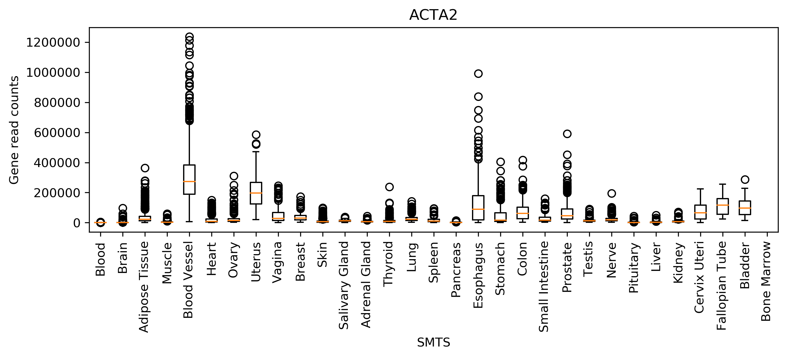

# parallel-arrays-profiling-and-benchmarking
Parallel Arrays, Profiling, and Benchmarking

## Description
This repository contains Python code for visualization of gene data by groups and members.

## How to use
The project is meant to be used by calling `plot_gtex.py` from the terminal. There are various input parameter best described by the argparse help output:

```
usage: plot_gtex.py [-h] [--gene_reads GENE_READS]
                    [--sample_attributes SAMPLE_ATTRIBUTES] [--gene GENE]
                    [--group_type GROUP_TYPE] [--output_file OUTPUT_FILE]
                    [--search_type SEARCH_TYPE]

Plot a gene data visualization from a file.

optional arguments:
  -h, --help            show this help message and exit
  --gene_reads GENE_READS
                        The file name of the gene data
  --sample_attributes SAMPLE_ATTRIBUTES
                        The file name of the gene sample attributes data
  --gene GENE           The gene to plot the data for
  --group_type GROUP_TYPE
                        Either tissue groups (SMTS), or tissue types (SMTSD)
  --output_file OUTPUT_FILE
                        The file name for the plot
  --search_type SEARCH_TYPE
                        The search type (b=binary, l=linear)
```

So you can simply run the program by calling:

```
python plot_gtex.py [options]
```

You will then be given a plot in the output file you have chosen that will look something like the one below:



## Profiling/Benchmarking
This project demonstrates the importance of a good search algorithm for large datasets. By profiling the Python script, I fould that the linear search took almost 16sec of total time while the binary search took less than 0.1sec of total time. This demonstrates the massive time savings by using a good search algorithm with this type of dataset.


## Installation
First, this project requires cloning the repository and making sure that you have Python 3 installed with `matplotlib`. Assuming Python 3 is already installed, you can run the below command to install the required package:

```
pip install matplotlib
```

You will also need the following files:
- https://github.com/swe4s/lectures/blob/master/data_integration/gtex/GTEx_Analysis_2017-06-05_v8_RNASeQCv1.1.9_gene_reads.acmg_59.gct.gz?raw=true
- https://storage.googleapis.com/gtex_analysis_v8/annotations/GTEx_Analysis_v8_Annotations_SampleAttributesDS.txt

You can download these to your repo directory using `wget`:

```
wget {file_name}
```
